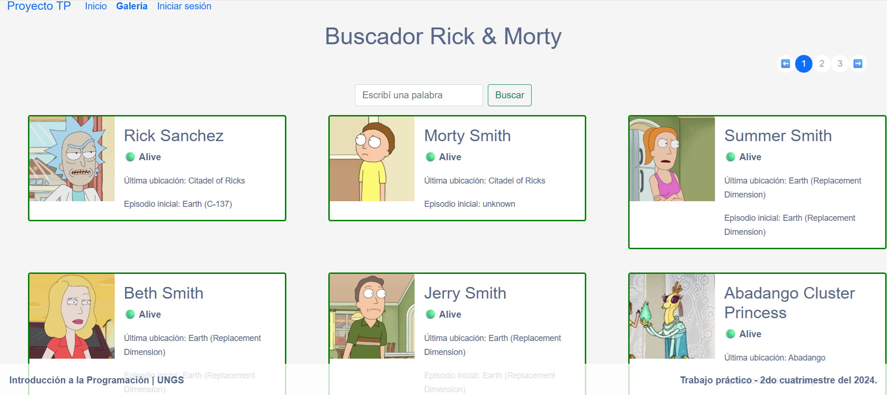
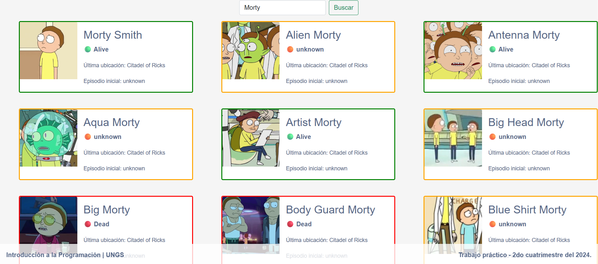
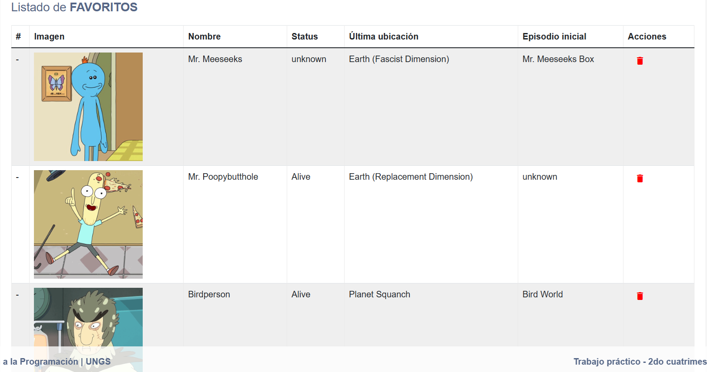

# 🧪 Buscador de personajes – Rick & Morty

Aplicación web desarrollada con **Django** que permite explorar personajes de la serie **Rick & Morty** utilizando su API pública.  
El proyecto fue realizado como trabajo práctico para la materia **Introducción a la Programación**.

---

## 📝 Descripción del proyecto

La aplicación consume datos de la **Rick & Morty API** y muestra los personajes en una galería de tarjetas.  
Cada tarjeta incluye información relevante del personaje y **cambia su apariencia según el estado** del mismo.

El sistema permite además:

- 🔍 Buscar personajes por nombre  
- 🔐 Iniciar sesión  
- ⭐ Gestionar una lista de favoritos  

## 📷 Capturas de la aplicación





---

## 🚀 Funcionalidades implementadas

- 🖼️ **Visualización de personajes** obtenidos desde la API  
- 🎨 **Galería dinámica** con tarjetas que muestran:
  - Imagen  
  - Nombre  
  - Estado  
  - Última ubicación  
  - Primer episodio  
- 🟩 **Borde de color según estado**:
  - Verde → vivo  
  - Rojo → muerto  
  - Naranja → desconocido  
- 🔍 **Buscador** de personajes por nombre  
- 🔐 **Inicio de sesión básico**  
- ⭐ **Sistema de favoritos** para usuarios autenticados  

---

## 🛠️ Tecnologías utilizadas

- Python  
- Django  
- SQLite  
- HTML / CSS  
- Bootstrap  

---

## 🧱 Arquitectura del proyecto

El proyecto está organizado en una **arquitectura por capas**, donde cada módulo tiene una responsabilidad específica:

- **Transport:** consumo de la API externa  
- **Services:** lógica de negocio  
- **Persistence:** acceso a la base de datos  
- **Utilities:** transformación de datos para las vistas  

Esta separación permite mantener el código organizado y facilitar futuras modificaciones.

---

## ▶️ Ejecución del proyecto

1. Instalar Python  
2. Instalar dependencias:
```pip install -r requirements.txt
```
3. Ejecutar el servidor
```python manage.py runserver 3000```
4. Abrir en el navegador
```http://localhost:3000```

---

## 🔐 Usuario de prueba

Para acceder a las funcionalidades de autenticación:

- **usuario:** admin  
- **contraseña:** admin  

---

## 🎯 Objetivo del trabajo

El objetivo del proyecto fue aplicar conceptos de desarrollo web utilizando Django, incluyendo:

- Consumo de APIs externas  
- Arquitectura en capas  
- Manejo de vistas y templates  
- Autenticación básica  
- Persistencia de datos
